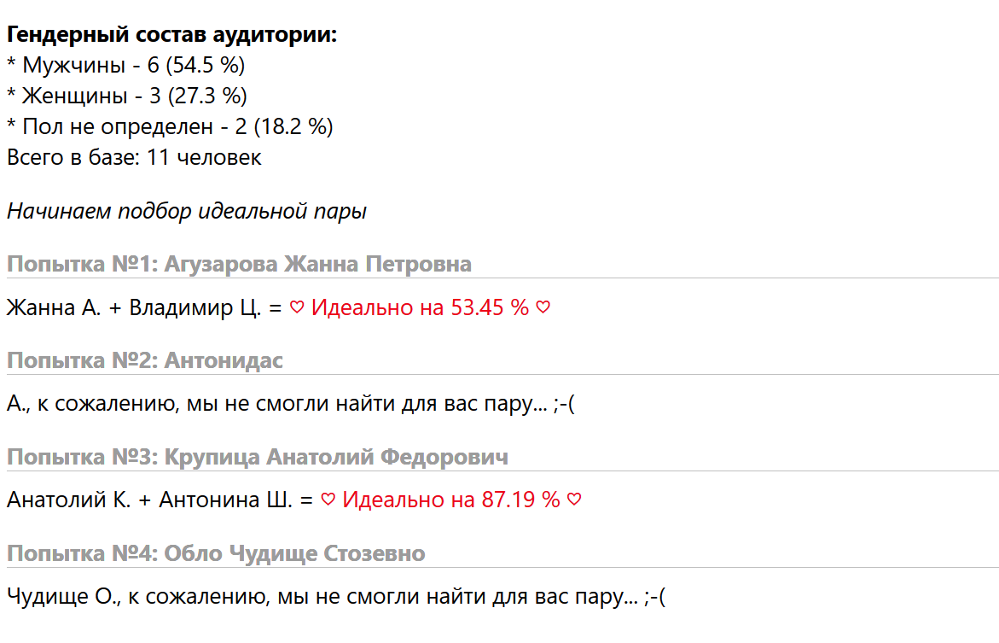

## Домашнее задание: 12.6.1 Практика PHP (HW-02) курса PHP-Pro (Skillfactory)
Автор: Александр Климок / [kydechuk01](https://github.com/kydechuk01/)
 Дата: 08.04.2024 

### В работе использованы:
- HTML5, PHP, CSS, Markdown
- Git via [github.com](https://github.com)
- Редактор VSCode

### Запуск проекта

* Файл [index.php](./index.php) - открыть в php-песочнице или через веб-сервер.

### Список решенных задач
- задача «Разбиение и объединение ФИО»: функции  `getFullnameFromParts`, `getPartsFromFullname`
  - код учитывает ситуации, когда в базе сохранено недостаточно полное имя;
- задача «Сокращение ФИО»: функция `getShortName`;
- задача «Функция определения пола по ФИО»: функция `getGenderFromName`;
- задача «Определение возрастно-полового состава»: функция `getGenderDescription`.
  - Код учитывает ситуации, что запись в базе может не содержать записи об имени и пропускает их в статистике;
- задача «Идеальный подбор пары»: функция `getPerfectPartner`.
  - Код не чувствителен к регистру символов во входном ФИО.
- подключены CSS-стили для лучшей визуализации
- результат работы показан на 4 примерах:
    - с полным именем для трех разных вариантов определенного пола
    - с вариантом неполного имени
  
### Пример вывода результатов работы
